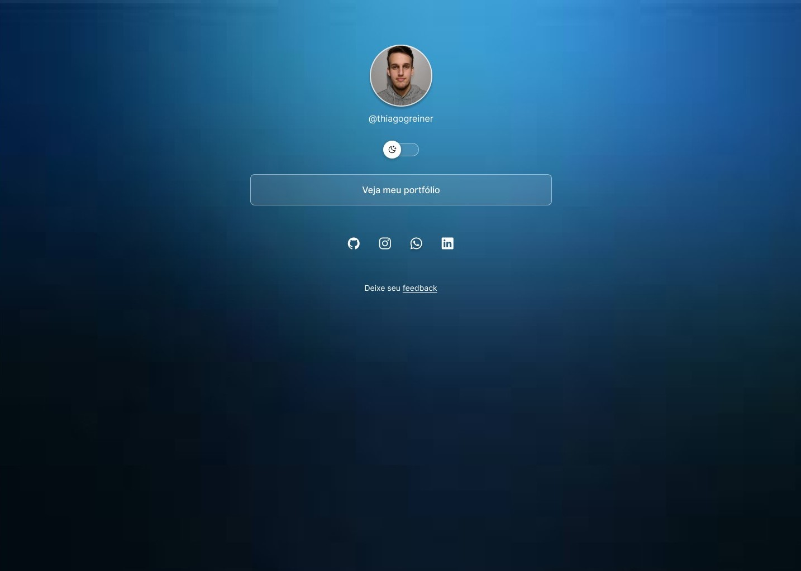

<h1 align="center">CARTÃO DE VISITA</h1>

Baseado nos programas de ensino de tecnologias WEB da Rocketseat.

  <a href="#-tecnologias">Tecnologias</a>&nbsp;&nbsp;&nbsp;|&nbsp;&nbsp;&nbsp;
  <a href="#-projeto">Projeto</a>&nbsp;&nbsp;&nbsp;|&nbsp;&nbsp;&nbsp;
  <a href="#-layout">Layout</a>&nbsp;&nbsp;&nbsp;|&nbsp;&nbsp;&nbsp;
  <a href="#-prototipo">Protótipo</a>

 

  

## 🚀 Tecnologias

Esse projeto foi desenvolvido com as seguintes tecnologias:

- HTML e CSS
- JavaScript
- Git e Github
- Figma

## 💻 Projeto

O Cartão de Visitas Online é uma plataforma inovadora que reimagina o conceito tradicional de cartões de visitas, transformando-os em poderosos agregadores de links personalizados. Esta ferramenta intuitiva e moderna serve como um cartão de boas-vindas digital, permitindo que os usuários consolidem todas as suas informações importantes e links relevantes em um único local acessível.

<strong>Recursos Principais:</strong>

1. Agregador de Links Personalizados: Os usuários podem adicionar uma variedade de links personalizados, como redes sociais, portfólio, site pessoal, blogs, contatos profissionais e muito mais.
2. Compatibilidade Responsiva: Os cartões de visitas online são otimizados para funcionar perfeitamente em dispositivos móveis, tablets e computadores, garantindo uma experiência consistente em qualquer plataforma.
3. Compartilhamento Facilitado: Os usuários podem compartilhar seus cartões de visitas online de forma rápida e conveniente por meio de um link único, QR code, ou integrando-o em suas assinaturas de e-mail.

<strong>Benefícios:</strong>

1. Profissionalismo Aprimorado: Os cartões de visitas online oferecem uma apresentação profissional e moderna, impressionando os contatos com uma abordagem inovadora.
2. Conveniência e Eficiência: Consolidar todos os links relevantes em um único local simplifica o processo de networking e aumenta a acessibilidade das informações importantes.

O Cartão de Visitas Online é a solução ideal para profissionais empreendedores, freelancers, influenciadores digitais, e qualquer pessoa que queira destacar sua presença online de forma elegante e eficaz. Experimente hoje mesmo e dê o próximo passo no networking digital!

## 🔖 Layout

Você pode visualizar o layout do projeto através [DESSE LINK](https://www.figma.com/design/DMCP81OkBAyR10BtV5b4pe/Untitled?node-id=0-1&t=AUayQiSiNNmJLWNN-1) ou o protótipo [NESTE LINK](https://www.figma.com/proto/DMCP81OkBAyR10BtV5b4pe/Untitled?node-id=0-129&node-type=canvas&t=AUayQiSiNNmJLWNN-0&scaling=min-zoom&content-scaling=fixed&page-id=0%3A1&starting-point-node-id=0%3A129&show-proto-sidebar=1). É necessário ter conta no [Figma](https://figma.com) para acessá-lo.

## 🖥 Protótipo

<a href="https://thiagogreiner.github.io/Cartao-de-Visita/">Visualize o protótipo aqui</a>
